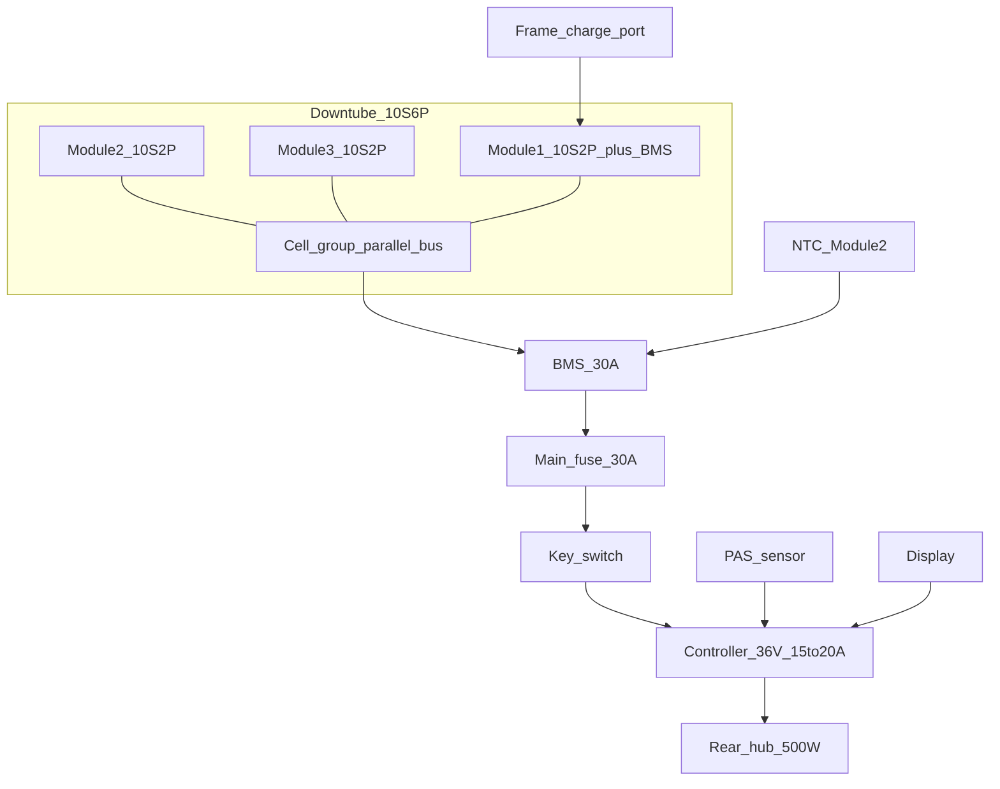

# Phase 1 — Electrical architecture

**Locked strategy:** Option A from the plan — one electrical battery (**10S6P**, ~21 Ah / ~756 Wh) physically split into **three 10S2P housings**, **one BMS**, one charge port. Modules look like three stock packs; electrically they are one pack.

Do **not** series the modules. Do **not** hard-parallel three independent BMS packs without a designed combiner (Option B is fallback only).

## System one-liner

36V nominal · 42V full · ~30V LVC · ~756 Wh · 500W-class rear hub · 15–20 A continuous controller · PAS + minimal display · no stock throttle (optional later)

## Cell math

| Item | Value |
|------|-------|
| Cell | Samsung INR18650-35E (or matched 3500 mAh 18650) |
| Series | 10S → 36V nominal (3.6V×10), 42.0V charge |
| Parallel | 6P → ~21 Ah |
| Total cells | 60 |
| Energy | 36V × 21Ah ≈ **756 Wh** |
| Module split | 3 × **10S2P** (20 cells each) |
| Inter-module links | Series strings stay 10S; parallel the three 2P groups into 6P **inside** the pack (nickel / bus) before a single BMS |

### Module wiring (preferred)

Each housing contains a **10S2P** brick. Parallel the three bricks at the pack bus (B+ / B− and balance taps joined correctly) so the BMS sees **10S6P**.

Balance lead: one 11-wire harness (B0–B10) from the combined 10S taps — typically taken from Module 1 with Modules 2–3 paralleled cell-group to cell-group with equal-length nickel/copper.

```
Module1 10S2P ──┐
Module2 10S2P ──┼──► combined 10S6P brick ──► BMS ──► discharge + charge
Module3 10S2P ──┘
```

## BMS

| Spec | Target |
|------|--------|
| Topology | 10S Li-ion, common-port or separate charge/discharge |
| Continuous discharge | ≥ **30 A** (headroom over 20 A controller) |
| Peak / burst | ≥ 45–60 A short |
| Charge | 42.0V CV; charger 2–5 A (4 A ≈ 5 h for 21 Ah) |
| Balance | Passive ≥ 50 mA or active preferred |
| Protections | OVP, UVP, OCD, short, temp (NTC on Module 2 mid-pack) |
| Temp cut | Charge inhibit below 0°C / above 45°C; discharge cut above 60°C typical |

Place BMS in **Module 1** (nearest charge port / BB) or in the controller-bay adjacent pocket — not buried mid-tube without service access.

## Charge / discharge ports

| Port | Spec |
|------|------|
| Charge | Frame-mounted sealed connector → BMS C+ / C− (or common P+) |
| Discharge | XT90-S (anti-spark) from BMS P+ / P− → main fuse → key switch → controller |
| Main fuse | **30 A** ANL or MIDI on P+, within 150 mm of pack bus |
| Key / contactor | Handlebar or frame key switch, ≥ 25 A continuous |

## Controller & motor

| Item | Spec |
|------|------|
| Voltage | **36V** only |
| Motor | Geared rear hub, 500W peak class, matching phase/hall plug |
| Controller continuous | **15–20 A** (≈ 540–720W electrical at 36V) |
| Controller mount | Ventilated bay under BB / lower seat tube — **not** inside pack cavity |
| PAS | Torque BB preferred; cadence acceptable (Roadster-like) |
| Display | Compact LCD/UART matching controller (KT, Bafang, or OEM-compatible) |
| Speed limit | Program Class 3 ≤ 28 mph (45 km/h) or local limit; stock Roadster was ~24 mph |
| Throttle | Omit for stealth/legal simplicity unless required |

### Harness gauge

| Circuit | Gauge | Notes |
|---------|-------|-------|
| Pack → controller | 12 AWG (10 AWG if &gt; 25 A peak) | Short as practical |
| Phase wires | Per motor OEM (often 14–12 AWG) | |
| Hall / PAS / display | OEM thin signal | Strain-relief at exits |
| Balance | 22–24 AWG | Service loop at Module 1 |

## Thermal & mechanical in-tube

- Closed-cell foam cradles each tray; leave a 3–5 mm air/wire channel along one wall  
- NTC epoxy to cell body on Module 2  
- After hard climb: IR or embedded temp — abort if pack wall &gt; 50°C sustained  
- Silicone grommets at all frame wire exits  
- Dielectric barrier between nickel bus and aluminum tube  

## Option B fallback (three discrete OEM packs)

Only if building Option A cells is not feasible:

1. Three identical 36V 7Ah packs, same age/SOC  
2. Voltage match ≤ 0.1V before parallel  
3. Per-pack fuse on each positive  
4. Equal lead lengths to bus  
5. Ideal-diode / multi-pack combiner (do not bare-wire three BMS outputs)  
6. Prefer separate charging; combined charge only with designed charge OR-ing  

## Bench procedure (before frame install)

See [05-commissioning.md](05-commissioning.md). Minimum Phase 1 gate:

1. Pack at 36–42V, balance ΔV &lt; 30 mV  
2. Controller powers display; PAS spins motor unloaded on stand  
3. Clamp meter ≤ controller rating under load  
4. LVC test on resistive load or controller setting verified  
5. Insulation megger or continuity: pack case / tube must not be live  

## Wiring diagram



## Phase 1 deliverables

- [x] Topology locked: 10S6P / 3 housings / 1 BMS  
- [x] Voltage platform locked: 36V  
- [x] Fuse, connector, gauge, thermal rules defined  
- [x] Controller bay separated from cells  
- [ ] Parts ordered per [bom/master-bom.md](../bom/master-bom.md) electrical section  
