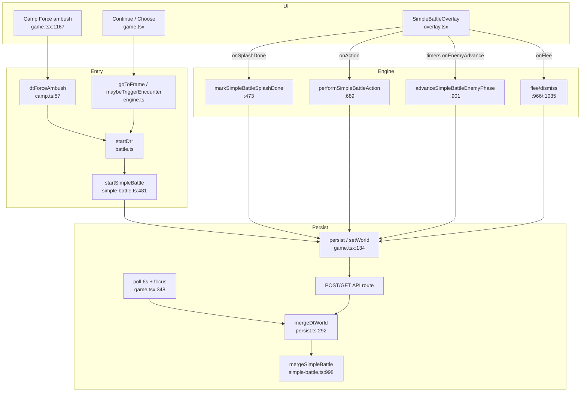

# DungeonTester Simple Battle — Full Audit (traced)

**Mode:** IMPLEMENTED — single FSM in `simple-battle.ts`; overlay presentation + one enemy timer/watchdog; game uses in-flight advance lock (no permanent `enemyAdvanceKeyRef`); intro arms once per `battle.id` via durable `splashDone`.  
**Baseline:** cleanup landed with `009b948` (+ endscreen wiring follow-up). Original audit traced against `9fac3c9`.  
**Neverworld:** `battle.ts` wrappers only; DT uses `SimpleBattleOverlay` exclusively. Sync is HTTP poll/POST only (no WS).

---

## 1. Complete call stacks (force ambush → stuck mid-attack)

### 1A. Force road ambush → INTRO → PLAYER (healthy mint)

```
UI click "Force road ambush →"
  dungeon-tester-game.tsx:1167 onClick={onForceAmbush}
  dungeon-tester-game.tsx:702  onForceAmbush()
  dungeon-tester-game.tsx:704  dtForceAmbush(world)
  camp.ts:57-60                  → startDtCampAmbush(world)
  battle.ts:22-26                → startSimpleBattle(world, { rng })
  simple-battle.ts:481-607       mint battle { id: uid("bat"), phase:"player",
                                   splashDone:false, status:"active", round:1 }
  dungeon-tester-game.tsx:705    persist(r.world)
  dungeon-tester-game.tsx:134-141 persist(): worldRef=stamped; setWorld(stamped);
                                   writeLocalDtWorld; fetch POST /api/.../dungeon-tester
  dungeon-tester-game.tsx:1224-1236 render <SimpleBattleOverlay battle={world.battle} … />
  simple-battle-overlay.tsx:338-362 splash arm useEffect([battle.id])
    → setIntroPhase("in")
    → setTimeout → setIntroPhase("out")   @ INTRO_HOLD_MS (1400)
    → setTimeout → finishSplash(id)       @ 1400+800
  simple-battle-overlay.tsx:274-283 finishSplash
    → finishedSplashIds.add(id); setIntroPhase("gone")
    → onSplashDoneRef() → onBattleSplashDone
  dungeon-tester-game.tsx:663-667 onBattleSplashDone
    → markSimpleBattleSplashDone (simple-battle.ts:473-478)
    → persist(… splashDone:true)
```

Guard: `startSimpleBattle` `simple-battle.ts:486-488` returns early if `world.battle` already set — **does not remint** while overlay open.

### 1B. Frame encounter mint (story Continue)

```
UI Continue
  dungeon-tester-game.tsx:567-571 onContinue → continueFrame(world)
  engine.ts:95-110 continueFrame → goToFrame(world, cur.next)
  engine.ts:41-92 goToFrame
    if world.battle → return "Finish the battle first." (46-48)
    maybe scripted: startDtBattleVs (81) → startSimpleBattle (battle.ts:30-35)
    else cadence: maybeTriggerEncounter (91)
      engine.ts:12-34 → if due: startDtRandomBattle → startSimpleBattle (battle.ts:14-18)
  persist(r.world) as above → overlay splash arm as 1A
```

### 1C. Attack click → ENEMY → timer → advance (intended) / freeze (broken latch)

Assume solo hero so one Attack spends last action.

```
UI Attack button
  simple-battle-overlay.tsx:561 onClick={() => pickAction(a.id)}
  simple-battle-overlay.tsx:397-409 pickAction("attack")
    → setAction + setNeedTarget("enemy")   // needs target
UI enemy hitbox
  simple-battle-overlay.tsx:465 onClick={() => pickTarget(u)}
  simple-battle-overlay.tsx:412-419 pickTarget
    → onAction(heroId, "attack", enemyId)
  dungeon-tester-game.tsx:1230 onAction={onBattleAction}
  dungeon-tester-game.tsx:586-603 onBattleAction
    worldRef.current; require phase==="player"
    performSimpleBattleAction(current, heroId, "attack", targetId)
      simple-battle.ts:689-894
        spend action, paint FX, checkEnd
        if !heroesStillActing → phase:"enemy", message:"Enemy turn…" (870-878)
    persist(r.world)  // React world + worldRef now ENEMY + FX

Overlay reacts to phase==="enemy":
  simple-battle-overlay.tsx:307-323 enemy advance useEffect
    setTimeout(tryAdvance, fx?700:180)     // ENEMY_ADVANCE_MS=700
    setTimeout(tryAdvance, 1600)          // ENEMY_FALLBACK_MS=1600
    tryAdvance → onEnemyAdvanceRef() → onBattleEnemyAdvance

  dungeon-tester-game.tsx:630-660 onBattleEnemyAdvance
    key = `${battle.id}:${battle.round}`
    if enemyAdvanceKeyRef === key → return          // *** LATCH ***
    if pendingRef → setTimeout(120ms) retry; return
    enemyAdvanceKeyRef = key                        // claim BEFORE advance
    advanceSimpleBattleEnemyPhase(current)
      simple-battle.ts:901-925
        require phase==="enemy"
        runEnemyPhase (662-687): foes act; then phase:"player", round++
    if result still phase==="enemy" → clear key     // only on failure/no-op
    else key REMAINS for this id:oldRound           // success path
    persist(r.world)
```

**Freeze endpoint (code-path deadlock, not speculative “maybe”):**

After `enemyAdvanceKeyRef` is set for `id:R` (`game.tsx:649`), any later `onBattleEnemyAdvance` while React/`worldRef` still shows `phase==="enemy"` and `round===R` hits `game.tsx:634` and **returns without calling advance**.  

Overlay timers (`overlay.tsx:315-316`) only fire **twice** per enemy-phase effect arm; interval watchdog was removed in `9fac3c9`. Effect cleanup sets `cancelled=true` (`overlay.tsx:318-320`), so cancelled callbacks cannot advance.

Combined deadlock when **key is claimed** and **timers are exhausted/cancelled** while UI state remains ENEMY for that same `id:R`:

- Controls: `controlsLocked` includes `!playerTurn` (`overlay.tsx:395`) → Attack disabled.
- Hint/msg: `"Enemy turn…"` (`overlay.tsx:539`, battle.message from perform).
- FX: clear effect **returns early** on enemy (`overlay.tsx:298-299`) → rays stay → **mid-attack freeze visual**.

Concrete code paths that leave (key set + still ENEMY):

| # | Traced path | Evidence |
|---|-------------|----------|
| F1 | Advance succeeds (engine → player) but React `world` still ENEMY for round R; `worldRef.current = world` (`game.tsx:124`) **overwrites** an eager persist stamp on a stale render; timer fires again → latch | `game.tsx:124` + `140` + `634` + `649` |
| F2 | `pendingRef`/`pending` stuck true after `setPending(true)` if throw before clear; both timeouts schedule 120ms retries then die; key may be unset but no more tries | `game.tsx:650-660`, `overlay.tsx:315-316`, `636-647` |
| F3 | tryAdvance while `pendingRef` true → no key claim; effect cleanup cancels pending timeouts on remount/dep churn before retry runs; later arm may see key already claimed from a partial prior success | `overlay.tsx:310-320`, `game.tsx:636-649` |

Unit path `perform → advance` without UI (`scripts/qa-simple-battle.ts`) does **not** use the latch — engine alone is not stuck.

---

## 2. Every function that can initiate a battle

**Sole mint:** `startSimpleBattle` — `simple-battle.ts:481` (HEAD).

| Caller | File:line | Trigger |
|--------|-----------|---------|
| `startDtRandomBattle` | `battle.ts:14-18` | Wrapper |
| `startDtCampAmbush` | `battle.ts:22-26` | Wrapper |
| `startDtBattleVs` | `battle.ts:30-35` | Wrapper |
| `maybeTriggerEncounter` | `engine.ts:29` | Frame cadence due |
| `goToFrame` | `engine.ts:81` | Scripted `battleFoeId` |
| `dtForceAmbush` | `camp.ts:57-60` | Camp UI |
| `onForceAmbush` | `game.tsx:702-705` | Camp button `:1167` |
| `continueFrame` / `chooseFrame` | `engine.ts:95+`, `113+` | Via `goToFrame` only |

**Cannot mint:** overlay, `mergeSimpleBattle`, `normalizeBattle`, poll. Poll may **reattach** an existing remote active battle (`game.tsx:377-382`) without calling `startSimpleBattle`.

**Remint of same fight:** not via `startSimpleBattle` while `world.battle` set (`:486-488`). New `battle.id` only when mint returns a new object (`uid("bat")` at `:578`).

---

## 3. Every useEffect / listener / timer that can restart or advance battle

### `simple-battle-overlay.tsx`

| Loc | Kind | Deps / when | Battle effect |
|-----|------|-------------|---------------|
| `:290-294` | useEffect | `focusHeroId, round, phase` | Clears action/target UI (not FSM) |
| `:296-303` | useEffect + `setTimeout(750)` | `fx, phase` | Calls `onFxDone` unless `phase==="enemy"` |
| `:307-323` | useEffect + 2×`setTimeout` | `status, phase, round` | **Advances enemy** via `onEnemyAdvance` |
| `:328-334` | useEffect | `id, round, phase, splashDone, status` | `finishSplash` when skip predicates true — **re-enters on phase/round** |
| `:338-362` | useEffect + 2×`setTimeout` | **`battle.id` only** | Arms START BATTLE intro OR skips to gone |
| `:365-376` | useEffect + `keydown` | `introPhase, battle.id` | Esc → `dismissSplash` → `finishSplash` |
| `:274-283` | function | click / timers | Splash complete → `onSplashDone` (first time only) |
| `:55` | module `Set` | session | `finishedSplashIds` survives remount |

No `requestAnimationFrame`. CSS may animate rays; no JS animation callback drives FSM.

### `dungeon-tester-game.tsx`

| Loc | Kind | Battle effect |
|-----|------|---------------|
| `:279-310` | useEffect boot fetch | Loads world (may include battle) |
| `:313-329` | `setInterval(1000)` playtime | `setWorld(addPlaytime)`; writes `worldRef` — can race battle authority |
| `:332-345` | `setInterval(15_000)` | POST local world (no mint) |
| `:348-415` | `setInterval(6000)` + `focus` | GET merge; `mergeSimpleBattle` for sticky active fight; peer ambush attach |
| `:581-582` | render body | `pendingRef.current = !!pending` every render |
| `:123-124` | render body | `worldRef.current = world` every render |
| `:637` | `setTimeout(120)` | Enemy-advance retry when pending |
| `:671-673` | useEffect | Clears `enemyAdvanceKeyRef` on **new `battle.id` only** |
| `:1272+` / `:1278+` | CreateSeat effects | Character create only — **not battle FSM** |

No websocket.

### API

`src/app/api/downtown/dungeon-tester/route.ts` — GET/POST world persistence; does not run combat logic.

---

## 4. Every place battle state is mutated

| Loc | Mutation |
|-----|----------|
| `simple-battle.ts:481` `startSimpleBattle` | Creates `world.battle` |
| `simple-battle.ts:473` `markSimpleBattleSplashDone` | `splashDone:true` |
| `simple-battle.ts:689` `performSimpleBattleAction` | units/fx/log/phase→enemy or stay player / finish |
| `simple-battle.ts:901` `advanceSimpleBattleEnemyPhase` | `runEnemyPhase` → player round++ or finish |
| `simple-battle.ts:928` `finishBattle` | victory/defeat summary |
| `simple-battle.ts:966` `dismissSimpleBattle` | `battle:null`, `clearedBattleId` |
| `simple-battle.ts:978` `clearSimpleBattleFx` | `fx:[]` |
| `simple-battle.ts:1035` `fleeSimpleBattle` | `battle:null`, soft recover |
| `simple-battle.ts:998` `mergeSimpleBattle` | Picks higher `simpleBattleProgressScore`; sticky `splashDone` |
| `simple-battle.ts:424` `ensureSimpleBattleSplashConsistency` | May stamp `splashDone` on load |
| `persist.ts:36-40` `normalizeBattle` | Consistency stamp on normalize |
| `persist.ts:345` `mergeDtWorld` | `mergeSimpleBattle` + cleared id drop |
| `game.tsx:134-141` `persist` | `setWorld` + localStorage + POST |
| `game.tsx:160-208` POST response | Re-merge battle into React state |
| `game.tsx:363-393` poll | Merge / peer attach / clear |
| `game.tsx:627` `onBattleFxDone` | `clearSimpleBattleFx` (skipped if enemy via early return `:626`) |
| Overlay | Mutates **local UI only** (`introPhase`, selection); battle blob only via callbacks above |

---

## 5. Duplicate battle managers / controllers / FSMs

| Layer | Role | Problem |
|-------|------|---------|
| `simple-battle.ts` | Pure combat transitions | Intended single engine |
| Overlay splash (`introPhase` + module Set + timers) | Intro UI | **Second intro controller** parallel to `splashDone` |
| Overlay enemy timeouts | Schedules ENEMY→PLAYER | Timing owned outside engine |
| Game `enemyAdvanceKeyRef` | Permanent per-round latch | **Third gate** on the same transition |
| Game `pending` / `pendingRef` | Click/timer mutex | Cross-coupled with latch |
| `mergeSimpleBattle` + progress score | Multiplayer/persist conflict solver | Can change which battle blob wins; not a turn manager |
| WIP FSM helpers on disk (`simpleBattleFsmStage`, `logSimpleBattleFsm`, unused `commitBattle`) | Dead code | Not wired — not a live duplicate yet |

**Neverworld BattleOverlay:** not in DT battle path.

---

## 6. Exact root causes (traced)

### 6.1 Intro replaying

**Not** repeated `startSimpleBattle` while fight open (guard `:486-488`).

Traced causes of START BATTLE UI / splash churn:

1. **Dual splash drivers** (`overlay.tsx:328-334` force-off on `phase/round/...` **and** `:338-362` arm on `battle.id`). Phase→enemy makes `simpleBattleShouldSkipSplash` true (`simple-battle.ts:414-420` includes `phase==="enemy"`), so force-off **re-invokes** `finishSplash` on every enemy entry. After first completion, early-out skips `onSplashDone` (`overlay.tsx:275-277`) but still touches `setIntroPhase`.
2. **Strict Mode / remount:** arm effect cleanup clears splash timers (`:356-360`) then remount re-runs for same `battle.id`. If neither `finishedSplashIds` nor `splashDone` stuck yet → `setIntroPhase("in")` again (`:353`) → **visible intro replay without remint**.
3. **Historical (fixed in `9fac3c9`):** force-off previously depended on `log.length` — each combat line re-fired splash finish (comment `:327`). Removed; remaining phase deps still wake the path.

Intro “restart” ≠ new `battle.id` unless a true remint (flee then new ambush, or new cadence fight).

### 6.2 Mid-battle freeze

Traced primary deadlock:

1. Last hero action → `phase:"enemy"` + FX held (`simple-battle.ts:870-878`).
2. Overlay schedules at most two advances (`overlay.tsx:315-316`); no interval.
3. `onBattleEnemyAdvance` **latches** `enemyAdvanceKeyRef = id:round` before advance (`game.tsx:649`); clears latch **only if still enemy after** (`:654-656`). Success leaves latch set for that round forever (until new `battle.id`, `:671-673`).
4. Any later call with same `id:round` still ENEMY → **hard return** (`:634`).
5. FX clear skipped on enemy (`overlay.tsx:298-299`) → frozen rays.
6. Controls require `playerTurn` (`:388-395`) → Attack dead; Flee still enabled unless `pending` (`:571`).

Amplifiers traced in same files: `worldRef.current = world` each render (`game.tsx:124`) vs eager `worldRef` in `persist` (`:140`); `pendingRef.current = !!pending` each render (`:582`).

### 6.3 Infinite render loops

**No infinite render loop found** in battle overlay/game:

- Force-off → `finishSplash` → `setIntroPhase` is bounded; early-out uses functional update that keeps `"gone"`.
- SplashDone persist flips `splashDone` once → one extra force-off run → early-out.
- CreateSeat magic effect (`:1278`) is unrelated.

High **churn** (extra renders on phase change) ≠ infinite loop.

### 6.4 Recursive state updates

- `onBattleEnemyAdvance` → `setTimeout(120)` → `onBattleEnemyAdvance` (`game.tsx:637-644`): **one-shot retry**, not unbounded recursion; stops when pending clears or key set or phase changes.
- No `setState` inside `setState` battle reducer recursion beyond React `setWorld(prev => …)` merges.

---

## 7. Dependency graph



Ownership today (split = bug surface):

- **Mint/combat math:** `simple-battle.ts`
- **Intro timing:** overlay (should not own FSM)
- **Enemy resolve timing + latch:** overlay timers + game latch (should not own FSM)
- **Blob conflict:** persist merge

---

## 8. Cleanup plan recommendation (**DO NOT IMPLEMENT**)

1. Revert/strip WIP prepend on `simple-battle.ts` or finish wiring real FSM logging once approved.
2. **Single engine** for transitions: keep mint/action/advance/flee/dismiss only in `simple-battle.ts`.
3. **Intro once:** one arm path keyed solely by `battle.id` + `splashDone`; **delete** force-off effect deps on `phase`/`round`.
4. **One timer chain** for ENEMY→PLAYER: in-flight lock only (clear when `phase!=="enemy"`), soft watchdog while enemy that only calls `advanceSimpleBattleEnemyPhase`; remove permanent `id:round` latch.
5. **One worldRef writer:** remove render-time `worldRef.current = world` and `pendingRef = !!pending` mirrors.
6. Flee always available while overlay mounted (don’t strand on stuck pending).
7. Keep merge progress rule that ranks bare enemy (spent=0) **below** idle player — do not “fix freeze” by undoing that.
8. Neverworld BattleOverlay stays unused.

---

## 9. Stop

Audit expanded and written. **No cleanup. No commit of fixes. No deploy.** Await explicit user approval.
